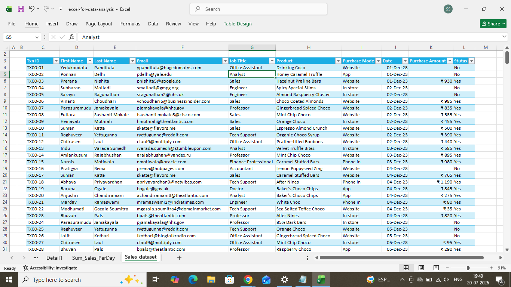
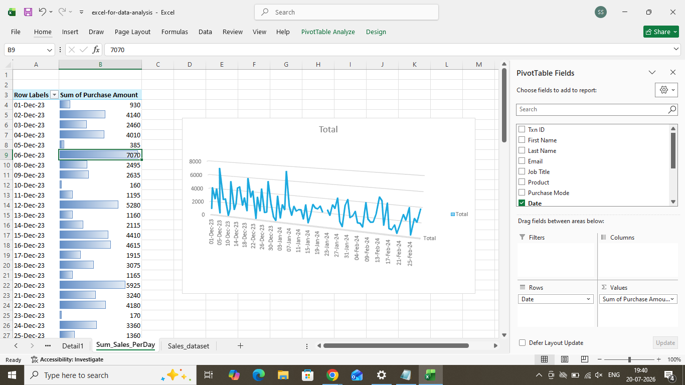
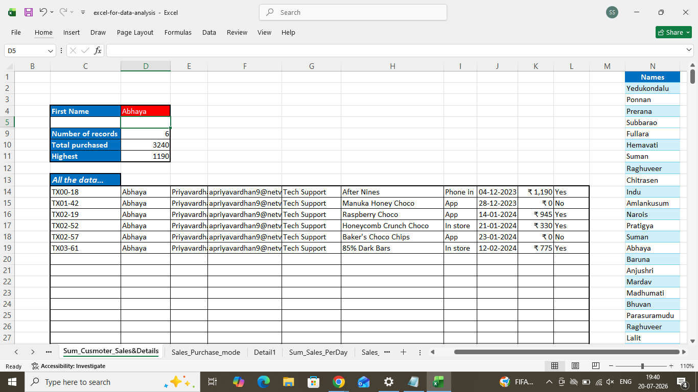
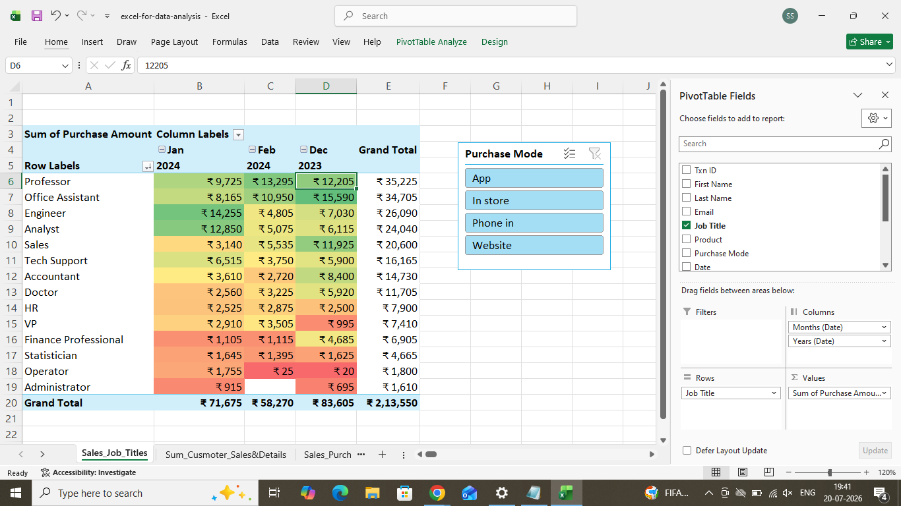
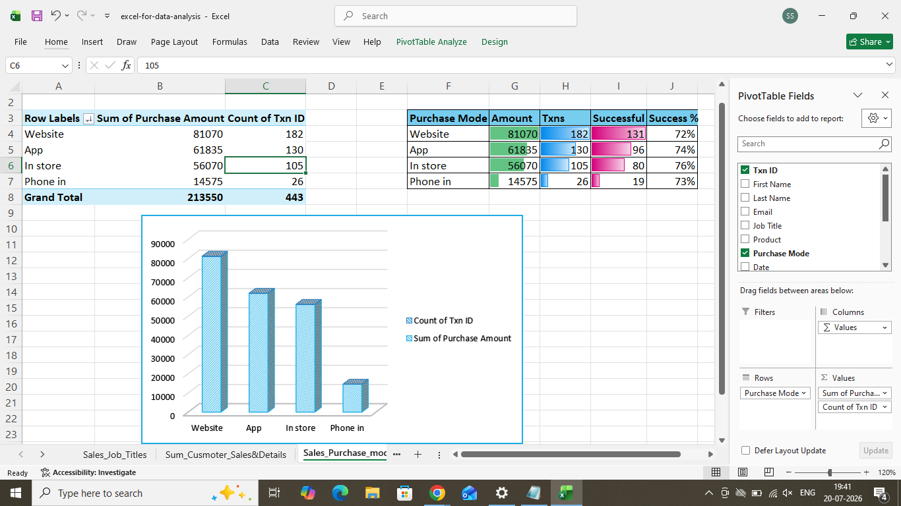

# 🍫 Chocolate Shop Sales Analysis using Microsoft Excel

## 📌 Project Overview

This project presents an interactive **Chocolate Shop Sales Analysis Dashboard** built using **Microsoft Excel**. The objective of the project is to transform raw sales data into meaningful business insights using Excel's powerful data analysis and visualization features.

The dashboard helps analyze sales performance, customer purchasing behavior, purchase channels, and revenue trends through interactive reports and charts.

---

## 📂 Dataset

The dataset contains the following information:

- Transaction ID
- Customer Name
- Email
- Job Title
- Product Purchased
- Purchase Mode
- Purchase Date
- Purchase Amount
- Order Status

---

## 📊 Dashboard Preview

### 1️⃣ Sales Dataset



---

### 2️⃣ Daily Sales Analysis

Analyzes total purchase amount for each day.

**Features**
- Pivot Table
- Pivot Chart
- Daily Revenue Trend



---

### 3️⃣ Customer Sales & Purchase Details

Interactive customer dashboard displaying:

- Customer Name
- Number of Purchases
- Total Purchase Amount
- Highest Purchase
- Complete Transaction History



---

### 4️⃣ Job Title Sales Analysis

Compares purchase amounts across different job titles with:

- Monthly Sales (December, January, February)
- Grand Total
- Purchase Mode Slicer
- Conditional Formatting Heat Map



---

### 5️⃣ Purchase Mode Analysis

Compares different purchase channels:

- Website
- App
- In Store
- Phone In

Includes:

- Total Revenue
- Total Transactions
- Successful Orders
- Success Percentage
- Pivot Chart



---

# ✨ Features

- Data Cleaning
- Excel Tables
- Pivot Tables
- Pivot Charts
- Slicers
- Conditional Formatting
- Data Bars
- Interactive Dashboard
- Customer-wise Analysis
- Sales Trend Analysis
- Purchase Mode Comparison
- Job Title-wise Revenue Analysis

---

# 🛠️ Tools Used

- Microsoft Excel
- Pivot Tables
- Pivot Charts
- Conditional Formatting
- Slicers
- Data Bars
- Excel Formulas

---

# 📈 Key Insights

- Website generated the highest overall revenue.
- Daily sales trends help identify peak sales periods.
- Purchase mode comparison highlights customer preferences.
- Customer-wise analysis identifies top buyers.
- Job title analysis reveals purchasing behavior across professions.
- Success rate analysis evaluates order completion performance.

---

# 📁 Repository Structure

```
Chocolate-Shop-Sales-Analysis/
│
├── Chocolate_Shop_Analysis.xlsx
├── README.md
├── dataset.png
├── sales_per_day.png
├── customer_analysis.png
├── job_title_analysis.png
└── purchase_mode_analysis.png
```

---

# 🚀 How to Use

1. Clone the repository.

```bash
git clone https://github.com/yourusername/Chocolate-Shop-Sales-Analysis.git
```

2. Open the Excel workbook.

```
Chocolate_Shop_Analysis.xlsx
```

3. Explore the dashboards.

4. Use the slicers to interact with the reports.

---

# 🎯 Skills Demonstrated

- Microsoft Excel
- Data Cleaning
- Data Analysis
- Dashboard Design
- Business Intelligence
- Data Visualization
- Pivot Tables
- Pivot Charts
- Analytical Thinking

---

# 📷 Dashboard Screenshots

| Dashboard | Description |
|------------|-------------|
| Dataset | Raw Sales Dataset |
| Sales Per Day | Daily Revenue Analysis |
| Customer Analysis | Customer Purchase Summary |
| Job Title Analysis | Revenue by Profession |
| Purchase Mode Analysis | Sales Channel Performance |

---

# 👨‍💻 Author

**Sai Sandeep Mathuraju**

- 📧 Email: *your-email@example.com*
- 💼 LinkedIn: https://linkedin.com/in/your-profile
- 💻 GitHub: https://github.com/your-username

---

## ⭐ If you found this project useful, consider giving it a Star!
